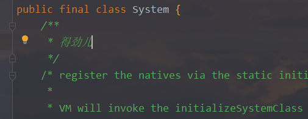

# 在IDEA中搭建Java源码学习环境并上传到GitHub上（转）
##目录
* [构建项目结构](#构建项目结构)
* [拷贝源码至项目](#拷贝源码至项目)
* [更改引用源码包使代码可修改](#更改引用源码包使代码可修改)
* [保存至GitHub上](#保存至GitHub上)

## 构建项目结构
#### 打开IDEA新建一个项目

#### 创建一个最简单的Java项目即可

#### 在项目命名填写该项目的名称，这里写的项目名为Java_Source_Study

#### 点击Finished，然后在项目的src目录下新建源码文件存放的包，这里创建的包直接为source

#### 项目结构构建好了，下面是源码的获取

## 拷贝源码至项目
#### 到本地JDK的安装目录下寻找一个src.zip的文件

#### 解压到本地目录中，这里解压到E盘的Java_Source目录下，解压完成后就能看见对应的源码包，如下图所示

#### 拷贝java，javax和org三个包，粘贴到项目中创建好的源码存放目录中，待拷贝完成后，IDEA会自动对新添加的文件创建索引

#### 索引创建完成之后会形成以下的目录结构

#### 此时我们创建一个测试源码的类，并编写一个简答的输出，然后通过 Ctrl+鼠标左键 或者 Ctrl+B 查看System的源码

## 更改引用源码包使代码可修改
#### 我们会发现打开的源码下有一个锁，这种状态下的源码是不允许做修改的，也就不可以在源码中添加自己做的笔记

#### 解决办法是修改项目中源码的引用，使其在引用源码的时候不使用默认的src.zip，而是使用我们项目中的源码文件，我们需要对项目进行配置，可以通过快捷键F4快速呼出，也可通过下图方式打开

#### 选中SDKs，然后选择右侧的Sourcepath，将默认引用的源码包(src.zip)删除，点击OK

#### 然后选择新增，选中我们项目的源码存放目录，点击OK，点击Apply，点击OK，即可将项目的源码引用改为项目内源码

#### 此时我们再次在测试源码的代码中使用 Ctrl+鼠标右键 或者 Ctrl+B 打开System的源码，会发现源码下的小锁不见了，而且，源码可以被修改了

#### 至此，一个Java源码学习环境就搭建完成了

## 保存至GitHub上
#### 下面介绍如何把把项目保存到GitHub上，从而实现永久保存，多端使用，按下图进行操作

#### 然后进行仓库名的设置，点击Share即可实现上传项目到GitHub上了

#### 至此，在IDEA上搭建Java源码学习环境并上传的GitHub上的教程就结束了